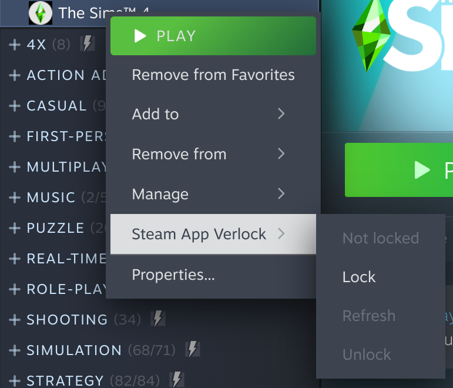
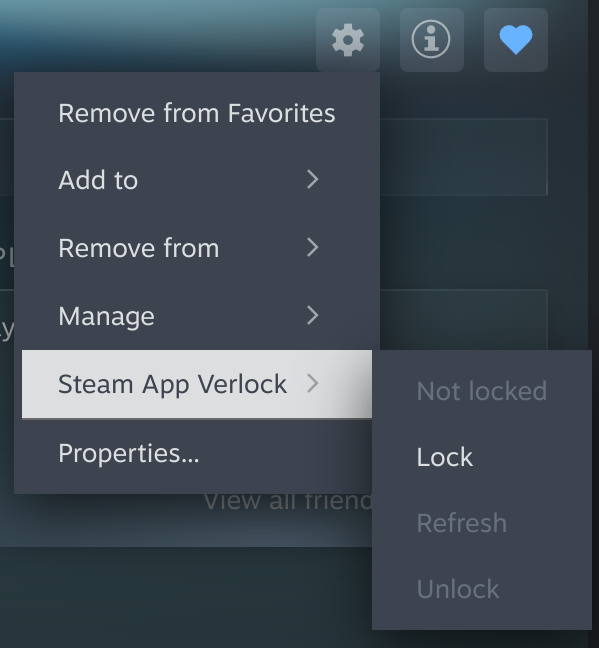
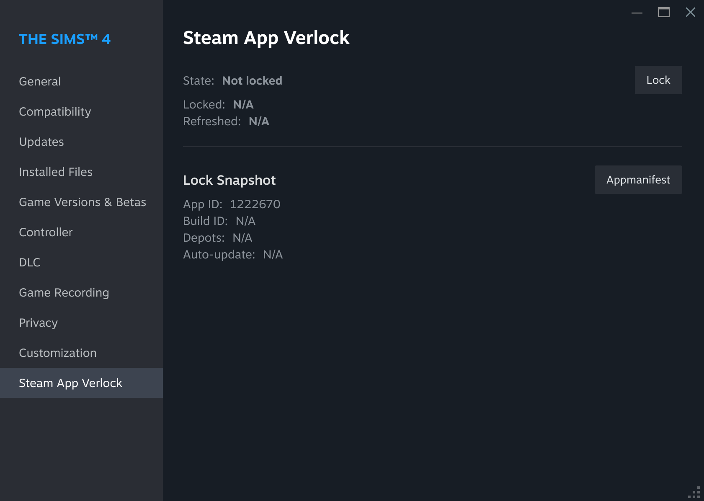
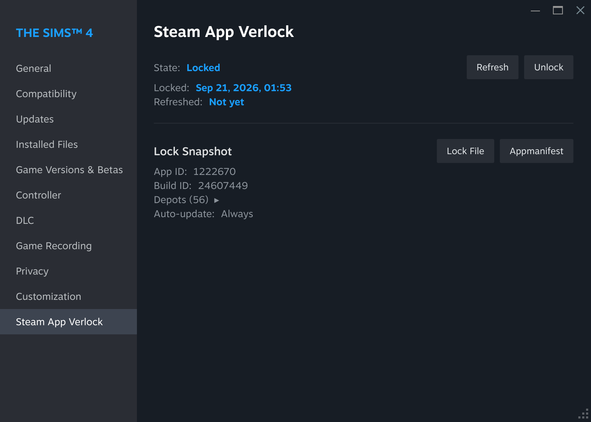
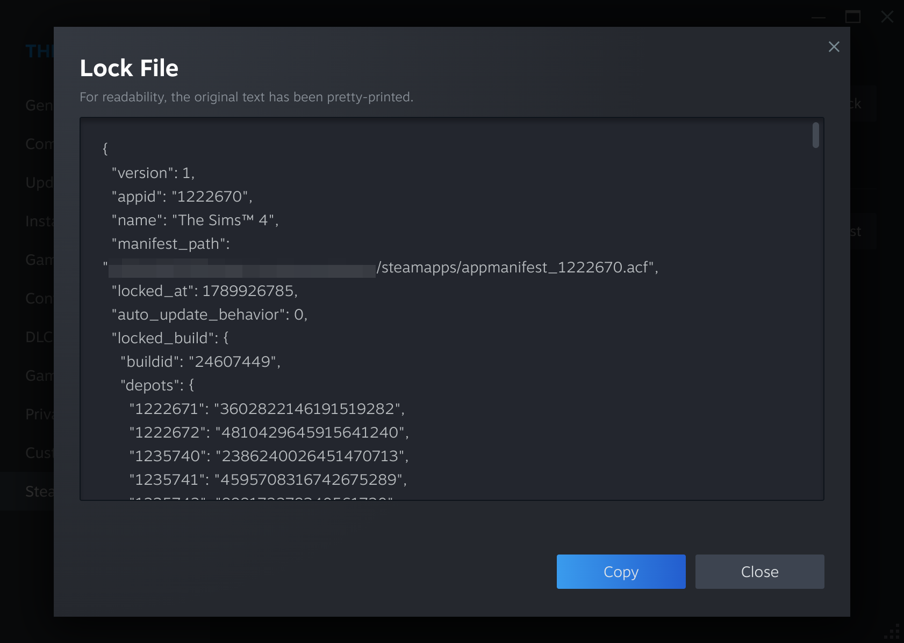
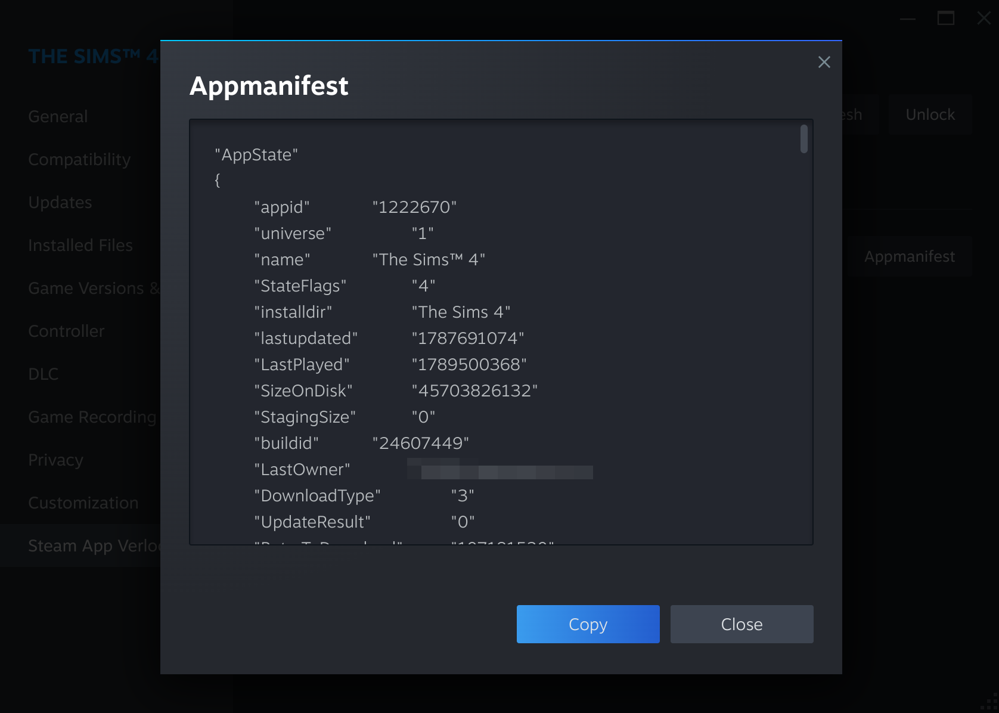
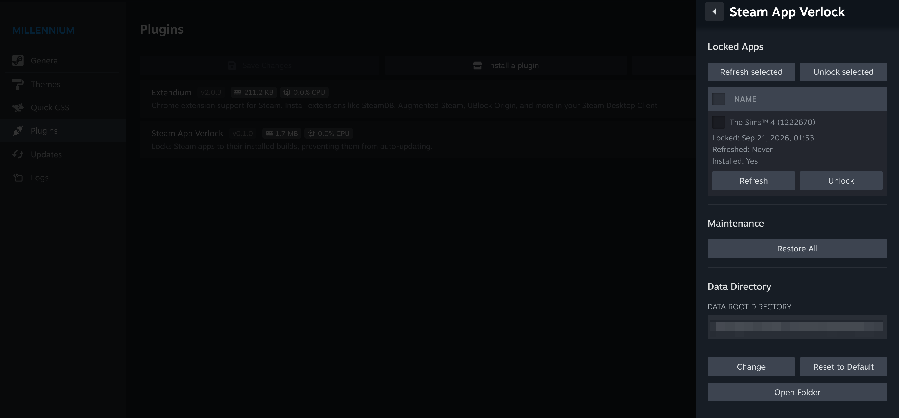

# Steam App Verlock for Millennium

**English** | [简体中文](README.zh-CN.md)

A [Millennium](https://steambrew.app/) plugin that locks Steam apps to their installed builds, preventing them from auto-updating.

## Background

The Steam client offers no way to pin an app to a specific build: it provides only silent auto-updates and the "only update when I launch it" deferral. Some users (for example players who use mods, or developers who need a fixed build) may want an app to stay on its current build and not auto-update.

This project provides that capability and fills the gap; at the same time, through the Millennium plugin system, it delivers a seamless locked-app experience inside the Steam client.

## How It Works

Community solutions today generally implement locking by modifying an app's manifest file (appmanifest), though the technical details vary. One widely circulated approach makes the manifest read-only so the Steam client cannot modify it, which locks the app ([reference](https://www.reddit.com/r/skyrimmods/comments/b158op/keep_skyrim_se_from_updating_safely_and/)). This plugin takes another, less invasive community approach ([reference](https://steamcommunity.com/sharedfiles/filedetails/?id=3517757180)): it modifies the manifest's contents rather than relying on file permissions. By changing fields such as the app state (`AppState`) and build information (`buildid`, `InstalledDepots`), it makes the Steam client believe the app is already on the latest version, so the client stops updating it on its own.

Maintaining this by hand is costly, because every app update requires fetching the latest build info and updating the manifest. This plugin maintains the lock automatically: on each update it fetches the latest build info through the Steam client console's `app_info_print` command and updates the manifest. It monitors app updates through two mechanisms: first, it refreshes the lock automatically when the Steam client reports that an update is available; second, it force-refreshes the lock once per hour as a fallback.

Because it does not change the manifest's permissions, the Steam client maintains the file normally, so there is a chance the client will still show an update prompt for a locked app. The plugin sets a locked app's update policy to "only update when I launch it" as a fallback, so it still has a chance to keep the lock through the periodic refresh or a manual refresh by the user.

## Supported Platforms

This plugin supports the Windows and Linux (x86-64) desktop Steam clients.

It does not support macOS, SteamOS devices, or Big Picture Mode. See [FAQ](#faq).

## Installing the Plugin

Steam App Verlock depends on Millennium: install [Millennium](https://steambrew.app/) first.

<!-- - **Plugin store**: open Millennium Settings → Plugins → "Install a plugin", then search for or enter the Steam App Verlock plugin ID. -->
- **Manual install**: download `steamapp-verlock.star` from [Releases](https://github.com/jks15satoshi/steamapp-verlock-millennium/releases), place it in Millennium's `plugins` directory, restart Steam, and enable it from the Millennium menu.

> The plugin is not yet listed in the plugin store; use the manual install.

## Features

### Managing the Lock State

You can perform the following operations on an installed app:

- **Lock to the current build**: lock the app to its currently installed build; once locked, the app no longer auto-updates.
- **Refresh the lock to the latest build**: when the app has a new release, use this to move the lock to the latest build (usually you do not need to do this by hand; the background detects and refreshes the lock automatically).
- **Unlock**: clear the app's lock state so it resumes auto-updates (or returns to the auto-update policy you had configured before locking).

You can perform these operations from the library context menu, the settings button on the right of the app page, and the app properties.

<!-- markdownlint-disable MD033 -->
<table>
  <thead>
    <tr>
      <th>Library context menu</th>
      <th>App page settings button</th>
      <th>App properties</th>
    </tr>
  </thead>
  <tbody>
    <tr>
      <td>
        
      </td>
      <td>
        
      </td>
      <td>
        
      </td>
    </tr>
  </tbody>
</table>
<!-- markdownlint-enable MD033 -->

Locking may take a few seconds. After locking, a lock badge is visible on the app page, showing the time of the most recent lock refresh.

### Lock State Maintenance

After an app is locked, the plugin continuously maintains the app's lock state so the Steam client does not auto-update it. When the Steam client reports that an update is available, the plugin automatically updates the app manifest to the latest version; as a fallback, it force-refreshes the lock once per hour.

### Inspecting the Lock State

After an app is locked, the properties page shows the lock state, the lock and lock-refresh times, and the lock snapshot (the app's build info at lock time).

You can click the "Lock File" and "Appmanifest" buttons to view the lock details and the current app manifest; this information may help when diagnosing a problem.

<!-- markdownlint-disable MD033 -->
<table>
  <thead>
    <tr>
      <th>Lock File</th>
      <th>Appmanifest</th>
    </tr>
  </thead>
  <tbody>
    <tr>
      <td>
        
      </td>
      <td>
        
      </td>
    </tr>
  </tbody>
</table>
<!-- markdownlint-enable MD033 -->

### Plugin Settings

You can configure the Steam App Verlock plugin in Millennium's settings. The settings page offers the following options:

- **Locked Apps list**: shows every locked app and supports multi-select batch refresh or unlock.
- **Restore All**: releases every locked app at once.
- **Data directory**: sets the plugin's data storage directory.

The default data storage directory for Steam App Verlock is:

- Windows: `%LOCALAPPDATA%\steamapp-verlock`
- Linux: `${XDG_DATA_HOME:-$HOME/.local/share}/steamapp-verlock`

The data directory holds the lock files of every locked app; at this stage it does not create much storage pressure. If the storage path bothers you, you can change it with the "Change" option, and the plugin migrates the data to the new path automatically.

## FAQ

### Can I install the plugin on my Steam Deck / Steam Machine?

**No.** First, to be clear, this refers to devices running native SteamOS; if your device has Windows installed, the restriction does not apply. There are two considerations:

1. The SteamOS that Steam Deck / Steam Machine runs is an immutable system with an A/B partition scheme. A plugin like Millennium, which works by injecting into the Steam binary, cannot persist there, so SteamOS is not an officially supported Millennium platform, and Steam App Verlock cannot receive official support on those devices either.
2. Many Steam Deck / Steam Machine users who want customization install Decky Loader to manage plugins, and Millennium is explicitly incompatible with Decky Loader, so using Millennium and its plugins on those devices may run into problems.

For these reasons, this plugin does not consider supporting SteamOS devices. For those users, we plan to develop a Decky Loader version of the plugin later to provide support.

### Does the plugin work in Big Picture Mode?

**Not at this stage.** Modifying the UI on the Gamepad UI is a separate system, and we have only considered the desktop UI so far. Millennium can theoretically work in Big Picture Mode, though, so we will re-evaluate if there is a clear need later.

### Can I install the plugin on a Mac?

**No.** Millennium currently offers only experimental macOS support, and Steam App Verlock does not plan to support macOS until Millennium supports it officially.

### Does locking an app affect my normal gaming experience?

**It depends.** As the plugin's mechanism shows, it only prevents Steam from updating a locked app so it stays on its current build; it does not modify the game's own files or configuration. For most single-player games, locking an app does not affect the normal gaming experience. But for games that rely on anti-cheat or DRM protection, or online multiplayer games that connect to public servers, locking the app may prevent connecting to servers, prevent the game from launching, or even lead to an account ban by the game's anti-cheat system or publisher; some P2P multiplayer games may also verify version consistency, which can prevent playing together. Before locking an app, make sure you fully understand the risks.

### Why do I sometimes still see an update prompt for a locked app?

**This is normal.** As the plugin's mechanism shows, it refreshes a locked app's state as promptly as it can, but it cannot guarantee that the refresh completes before the client shows the update prompt.

For this case, we also provide two fallbacks to ensure the update is never actually applied: first, setting the update policy to "only update when I launch it" keeps the client from applying the update automatically; second, when you click the "Update" button, the plugin intercepts it and cancels the update automatically. When a locked app shows an update prompt, you only need to run "Refresh" manually.

### Can the plugin guarantee that locking works for every app?

**It cannot.** This mechanism only applies to apps managed directly through the Steam client. If an app depends on a third-party launcher that updates itself, or has its own self-update mechanism, the plugin cannot effectively stop its updates.

## Contributing

Thanks for your support. We welcome any kind of contribution, including bug reports, feature requests, documentation, and code.

To contribute code, read [CONTRIBUTING.md](CONTRIBUTING.md) for the project's contribution process and conventions.

## License and Disclaimer

Copyright © 2026 Satoshi Jek. Licensed under the [MIT License](LICENSE).

This project operates on and simulates the internal files of the Steam client, which strictly speaking may violate the [Steam Subscriber Agreement](https://store.steampowered.com/subscriber_agreement/). By using this project you acknowledge these risks and agree to bear all consequences that follow from them.

This project has no affiliation with Valve whatsoever.
