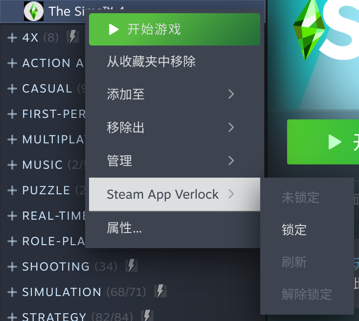
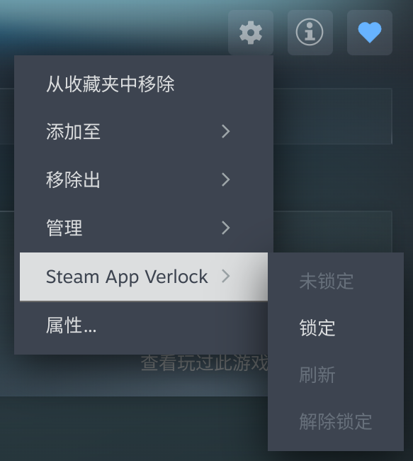
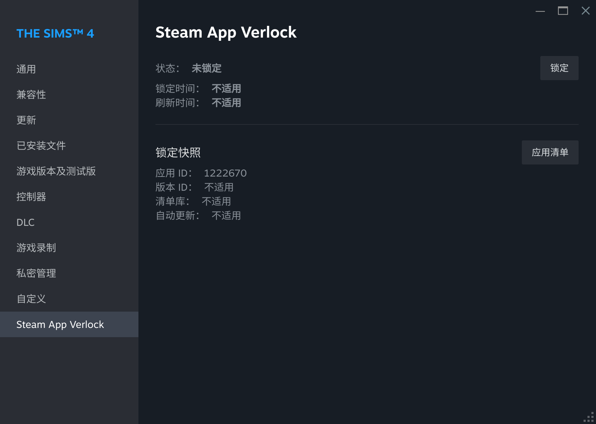
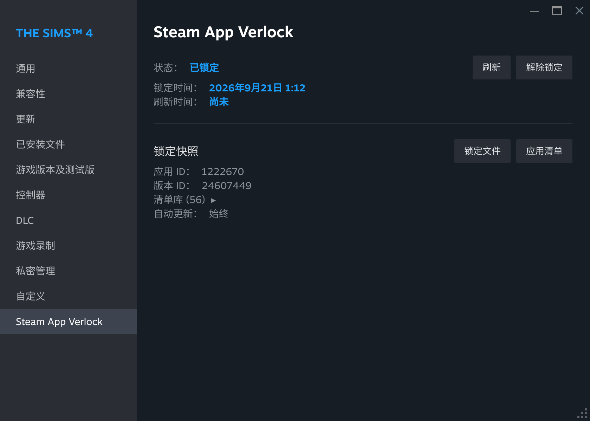
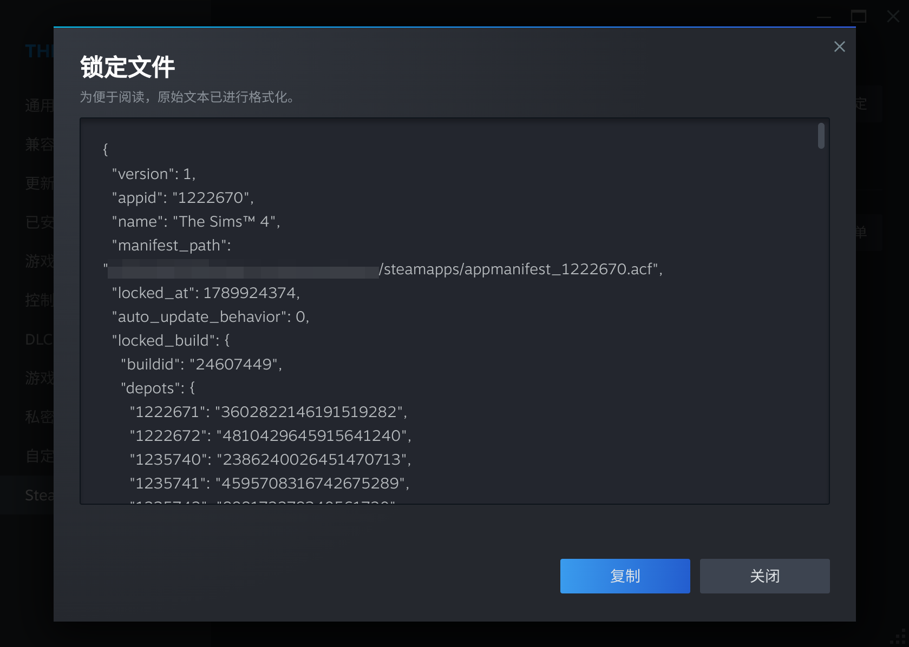
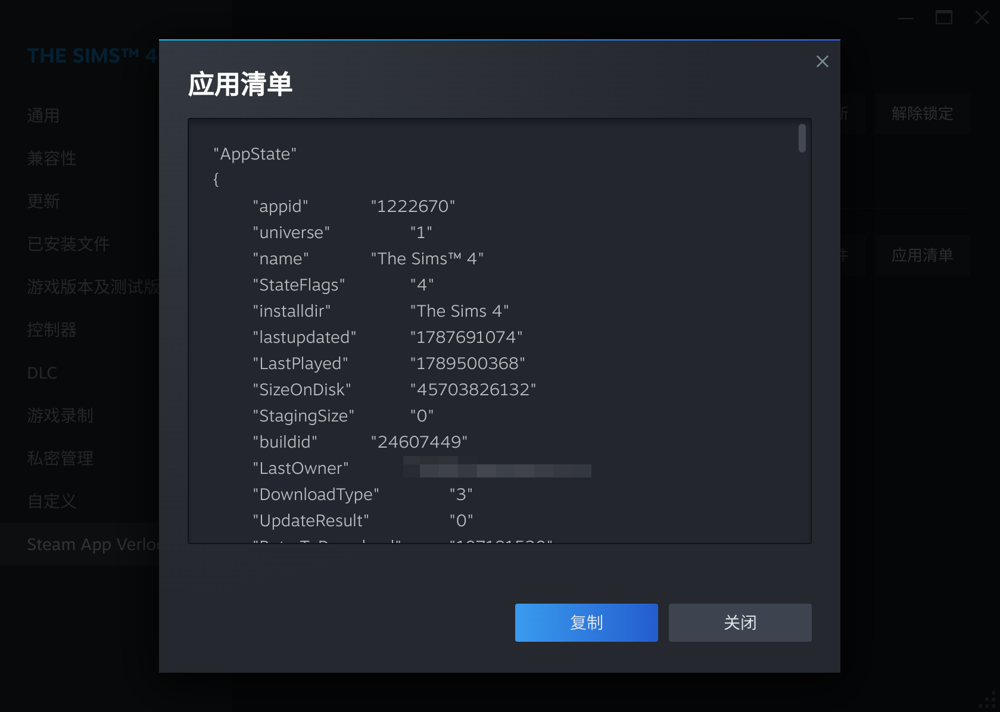
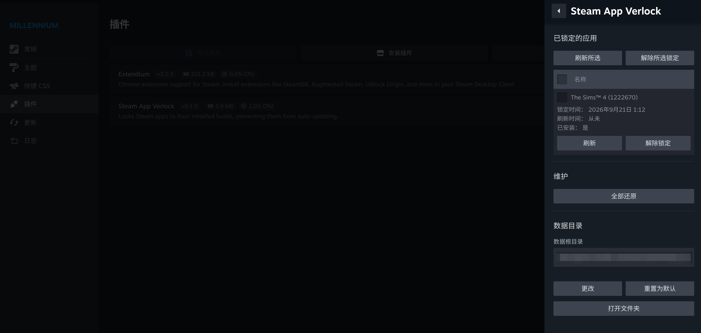

# Steam App Verlock for Millennium

[English](README.md) | **简体中文**

一个 [Millennium](https://steambrew.app/) 插件，将 Steam 应用锁定在其已安装的构建版本，阻止其自动更新。

## 背景

Steam 客户端不提供将应用锁定在特定构建版本的功能：它只提供静默自动更新以及“仅在启动时更新”的延缓更新选项。但有些用户（例如使用 Mod 的玩家，或需要固定构建的开发者）可能希望应用保持在当前构建版本、不被自动更新。

本项目旨在提供这一功能，补齐这一需求；同时，借助 Millennium 插件系统，实现在 Steam 客户端内关联应用锁定的无缝体验。

## 工作原理

目前社区提供的方案基本都是通过修改应用的清单文件（appmanifest）来实现锁定，但在技术细节上可能各有差异。一种广泛流传的方式是修改清单文件的权限，使其只读，使 Steam 客户端无法修改该文件，从而实现锁定（[参考](https://www.reddit.com/r/skyrimmods/comments/b158op/keep_skyrim_se_from_updating_safely_and/)）。本插件采用了社区提供的另一种侵入性更低的方案（[参考](https://steamcommunity.com/sharedfiles/filedetails/?id=3517757180)），即通过修改清单文件的内容来实现锁定，而不依赖于文件权限的更改。通过修改清单文件中的应用状态 (`AppState`)、构建版本信息（`buildid`、`InstalledDepots`）等字段，使 Steam 客户端认为该应用已处于最新版本，从而主动停止更新行为。

手动维护这一方案成本较高，因为每次应用更新都需要获取最新的构建信息并更新清单文件，而本插件则通过自动化的方式持续维护锁定状态，在每次更新时通过 Steam 客户端控制台的 `app_info_print` 命令获取最新的构建信息并更新清单文件。本插件通过两套机制监测应用更新状态：一是在 Steam 客户端汇报应用存在更新时自动刷新锁定；二是周期性强制刷新一次锁定作为兜底机制。

由于未修改清单文件的权限，Steam 客户端会正常维护此文件，有一定概率客户端会显示应用可更新的提示。本插件会将锁定应用的更新策略调整为“仅在启动时更新”作为兜底措施，使得插件仍有机会通过定时刷新机制或由用户手动刷新锁定来维持锁定状态。

## 支持平台

本插件支持 Windows 与 Linux (x86-64) 桌面版 Steam 客户端。

不提供对 macOS、SteamOS 设备以及 Big Picture Mode 的支持。详见 [FAQ](#faq) 部分。

## 安装插件

Steam App Verlock 依赖 Millennium：请先安装 [Millennium](https://steambrew.app/)。

<!-- - **插件商店**：打开 Millennium 设置 → 插件 → “安装插件”，搜索或输入 Steam App Verlock 的插件 ID 进行安装。 -->
- **手动安装**：从 [Releases](https://github.com/jks15satoshi/steamapp-verlock-millennium/releases) 下载 `steamapp-verlock.star`，放入 Millennium 的 `plugins` 目录，重启 Steam 后在 Millennium 菜单中启用。

> 目前暂未将此插件上架至插件商店，请使用手动安装方式。

## 功能

### 管理锁定状态

你可以对已安装的应用进行以下操作：

- **锁定当前构建版本**：将应用锁定在当前已安装的构建版本，锁定后应用将不会再自动更新。
- **刷新锁定到最新构建**：当应用有新版本发布时，使用此操作将锁定更新到最新构建（不过通常是不需要你来手动操作的，后台会自动检测并刷新锁定）。
- **解除锁定**：取消应用的锁定状态，使其恢复自动更新（或恢复到锁定前用户自行配置的自动更新策略）。

上述操作可以通过库右键菜单、应用页右侧的设置按钮以及应用属性中进行。

<!-- markdownlint-disable MD033 -->
<table>
  <thead>
    <tr>
      <th>库右键菜单</th>
      <th>应用页右侧设置按钮</th>
      <th>应用属性</th>
    </tr>
  </thead>
  <tbody>
    <tr>
      <td>
        
      </td>
      <td>
        
      </td>
      <td>
        
      </td>
    </tr>
  </tbody>
</table>
<!-- markdownlint-enable MD033 -->

锁定可能会花费数秒钟的时间，锁定后在应用页上可以看到锁定徽章，同时显示最近一次刷新锁定的时间。

### 锁定状态维护

应用锁定后，插件会持续维护该应用的锁定状态，确保其不会被 Steam 客户端自动更新。插件会在 Steam 客户端汇报应用存在更新时，自动将应用清单更新到最新版本；作为兜底，每 1 小时会强制刷新一次锁定。

### 检视锁定状态

应用锁定后，在属性页面中可以看到锁定状态、锁定与刷新锁定时间，以及锁定快照（即应用在锁定时的构建信息）。

你可以点击“锁定文件”按钮与“应用清单”按钮，查看锁定详细信息以及当前的应用清单信息，这些信息可能对排查调试问题有所帮助。

<!-- markdownlint-disable MD033 -->
<table>
  <thead>
    <tr>
      <th>锁定文件</th>
      <th>应用清单</th>
    </tr>
  </thead>
  <tbody>
    <tr>
      <td>
        
      </td>
      <td>
        
      </td>
    </tr>
  </tbody>
</table>
<!-- markdownlint-enable MD033 -->

### 插件设置

Millennium 设置中可以对 Steam App Verlock 插件进行配置。设置页中提供以下功能选项：

- **已锁定应用列表**：显示所有已锁定的应用，支持多选批量刷新锁定或解除锁定。
- **一键还原**：一次性解除所有已锁定应用的锁定状态。
- **配置数据目录**：设置插件的数据存储目录。

Steam App Verlock 默认的数据存储目录为：

- Windows: `%LOCALAPPDATA%\steamapp-verlock`
- Linux: `${XDG_DATA_HOME:-$HOME/.local/share}/steamapp-verlock`

数据目录中会存放所有已锁定应用的锁定文件，现阶段不会产生较大的存储压力；如果你介意存储路径，可以通过“更改”选项进行修改，插件会自动将数据迁移到新的存储路径。

## FAQ

### 插件可以安装在我的 Steam Deck / Steam Machine 上吗？

**不可以。** 首先澄清，这里说的是搭载原生 SteamOS 的设备，如果你的设备刷入了 Windows，则不受限制。这里有两部分考量：

1. Steam Deck / Steam Machine 运行的 SteamOS 是不可变系统，采用 A/B 分区机制，像 Millennium 这种通过注入 Steam 二进制文件实现功能的插件无法持久化，因此 SteamOS 并没有成为 Millennium 官方支持的平台，因此 Steam App Verlock 也无法在这些设备上获得官方支持。
2. 许多有个性化需求的 Steam Deck / Steam Machine 用户都会安装 Decky Loader 来管理插件，而 Millennium 明确不兼容 Decky Loader，因此在这些设备上使用 Millennium 及其插件可能会遇到问题。

综上所述，本插件不考虑支持 SteamOS 设备。对于这部分用户，我们有计划会在后续开发 Decky Loader 版本的插件以提供支持。

### 插件是否可以工作在 Big Picture Mode 上？

**现阶段不可以。** 在 Gamepad UI 上修改 UI 是另一套体系，我们目前只考虑了桌面端的 UI。不过理论上 Millennium 可以在 Big Picture Mode 上工作，后续如果有明确需求我们会再做评估。

### 插件可以安装在 Mac 上吗？

**不可以。** 由于 Millennium 目前只提供对 macOS 的实验性支持，在 Millennium 提供对 macOS 的正式支持以前，Steam App Verlock 不计划提供对 macOS 的支持。

### 锁定应用会对我正常游戏体验产生影响吗？

**分情况讨论。** 从工作机制上你能知道，插件仅仅只是避免 Steam 更新已锁定的应用，使其保持当前版本，不会修改游戏本身的文件或配置。对于大多数单机游戏，锁定应用不会对正常游戏体验产生影响。但对于依赖于反作弊或 DRM 保护的游戏，或者连接公共服务器的在线多人联机游戏，锁定应用可能导致无法正常连接服务器、无法启动游戏，甚至可能被游戏的反作弊系统或发行商封禁账户；部分 P2P 联机游戏可能也会验证版本一致性，从而导致无法正常联机。锁定应用前请务必充分了解相关风险。

### 为什么有时候我还能看到已锁定应用提示更新？

**这是正常现象。** 根据插件的工作机制，插件会尽量及时刷新已锁定应用的状态，但无法保证一定可以在客户端提示更新前完成刷新动作。

对于这种情况，我们也提供了两套兜底机制确保更新不会实际执行：一是通过设置更新策略为“仅在启动时更新”确保客户端不会自动执行更新动作；二是当点击“更新”按钮时，插件会予以拦截，自动取消更新操作。遇到已锁定应用提示更新时，只需要手动执行“刷新”操作即可。

### 插件是否可以保证对所有应用的锁定有效？

**无法保证。** 这套机制仅适用于通过 Steam 客户端直接管理的应用，如果应用依赖的第三方启动器有自主更新行为，或者有自更新机制，插件无法有效阻止其更新行为。

## 贡献

首先感谢你的支持。我们欢迎任何形式的贡献，包括但不限于提交 bug 报告、提出功能请求、撰写文档、提交代码等。

如需贡献代码，请先阅读 [CONTRIBUTING.zh-CN.md](CONTRIBUTING.zh-CN.md)，了解项目的贡献流程与规范。

## 许可协议与免责声明

Copyright © 2026 Satoshi Jek。本项目基于 [MIT 协议](LICENSE) 授权。

第三方声明在 [CREDITS](CREDITS) 文件中列出。

本项目的实现方式涉及操作/模拟 Steam 客户端内部文件，严格意义上可能涉嫌违反[《Steam 订户协议》](https://store.steampowered.com/subscriber_agreement/)。使用本项目即表示你已了解上述风险，并愿意自行承担由此产生的一切后果。

本项目与 Valve 无任何关联。
